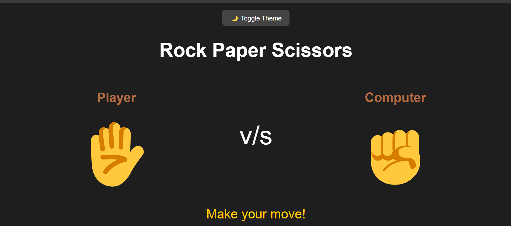

# ✊ Rock Paper Scissors Game

A simple, interactive, and stylish **Rock-Paper-Scissors** game built using **HTML**, **CSS**, and **JavaScript**. Play against the computer, track your score, and enjoy fun animations and theme toggling!

---


## 🎮 Live Demo

[Play the Game Here](https://kareemhazem363.github.io/rock-paper-scissors/)

---

## 📸 Screenshot



---

## 🔥 Features

- ✊ Classic Rock/Paper/Scissors logic
- 🤖 Computer AI opponent
- 🤝 Animated hand shake
- ⏱️ Countdown before result
- 🌗 Light/Dark mode toggle
- 📊 Score tracking (Win/Lose/Draw)
- 🔁 Play again and reset all options

---

## 🛠️ Tech Stack

- HTML5  
- CSS3  
- Vanilla JavaScript

---

## 🚀 How to Run It Locally

1. Clone the repo:
```bash
git clone https://github.com/Kareemhazem363/rock-paper-scissors.git
cd rock-paper-scissors
```

2. Open `rock_paper_scissor.html` in your browser

---

## 📁 File Structure

```
rock-paper-scissors/
├── index.html
├── rock_paper_scissor.css
├── rock_paper_scissor.js
├── README.md
└── rock-paper-scissors.png  
```

---

## 🙌 Author

**Kareem Hazem**  
GitHub: [@Kareemhazem363](https://github.com/Kareemhazem363)

---

## 📄 License

This project is licensed under the [MIT License](LICENSE)
